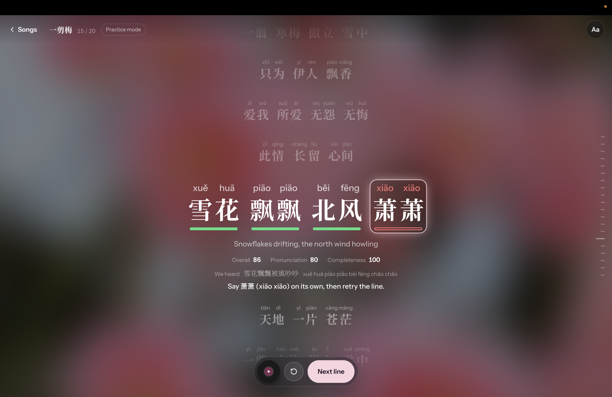
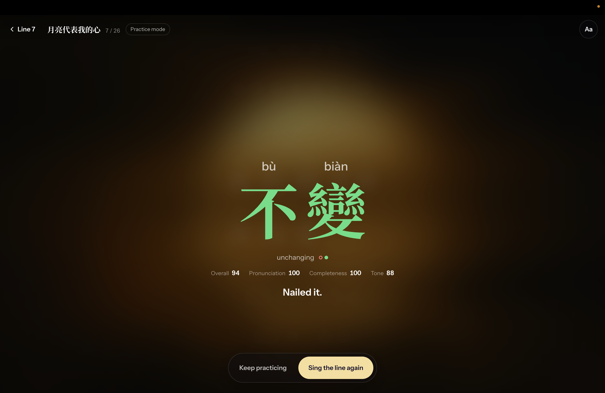
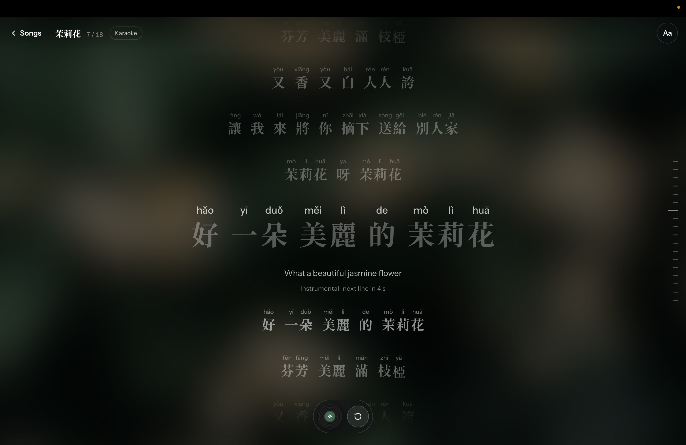

# Lotus Roots

**Learn Mandarin through the songs you love.**

Lotus Roots brings pronunciation practice and karaoke together in a desktop web app. Listen to a line, sing or say it back, and see feedback on every word. Focus on a difficult word for individual practice, or sing the whole song with synchronized lyrics.

A vinyl-inspired song browser, animated artwork, and an immersive lyric view make practice feel like listening to a record.

## Highlights

- **Line-by-line pronunciation feedback.** Record a lyric and receive word grades, pronunciation scores, and tips for Mandarin initials and finals.
- **Focused word practice.** Select any word to hear a spoken reference, record your pronunciation, and try again. Optional tone assessment supports spoken practice.
- **Karaoke with synchronized lyrics.** Sing along to an instrumental while Hanzi fills character by character in time with the song.
- **Lyrics made for learners.** Follow Hanzi, toggle Pinyin, and read translations where available.
- **Local speech recognition.** Whisper runs on your machine, with an MLX engine for native macOS and a CPU engine for Linux and Docker.
- **An expressive interface.** Song-specific colours, vinyl interactions, fullscreen playback, and keyboard controls carry through the listening experience.
- **A reusable song pipeline.** Build lyric bundles, generate spoken word clips, align syllable timings, and separate vocals to create instrumentals.

## Screenshots

| Song browser | Pronunciation practice |
| :---: | :---: |
|  Artwork, vinyl selection, and play modes |  Line recording and word-by-word feedback |
| **Word practice** | **Karaoke** |
|  Spoken references and focused retries |  Instrumental playback and synchronized lyrics |

## How it works

In **Practice mode**, the browser plays one line of the original song, then records your unaccompanied attempt. The backend transcribes it with Whisper, matches the Mandarin syllables to the lyric, and returns pronunciation grades and feedback. Selecting a word opens spoken practice for that word.

In **Karaoke mode**, the instrumental plays while the lyrics follow the track. This mode is for singing along and does not record or grade you.

The backend also includes optional CTC alignment, rhythm assessment, and pitch-based tone assessment. Tone is assessed in spoken word practice, where lexical tones can be heard independently of a melody. CTC and rhythm scoring are available for the backend's `singing` attempts; the app's Practice mode uses the Whisper base grader.

## Tech stack

| Area | Technologies |
| --- | --- |
| Frontend | React, TypeScript, Vite, Tailwind CSS, Motion, Three.js |
| Backend | Python, FastAPI, Pydantic, uv |
| Speech and pronunciation | Whisper via `mlx-whisper` / `faster-whisper`, PyTorch, torchaudio, Pinyin matching |
| Tone and song preparation | Praat/Parselmouth, Demucs, PyAV, edge-tts |
| Testing | pytest, Vitest |

## Run locally

### Requirements

- Python 3.12 and [uv](https://docs.astral.sh/uv/)
- Node.js 22 and npm
- Desktop Chrome with microphone access for pronunciation practice

Use WSL2 for the native setup on Windows. Grading runs locally after model weights are downloaded; the first real-grading startup needs internet. Audio decoding uses PyAV, so a system ffmpeg installation is not required.

Clone the repository:

```bash
git clone https://github.com/huamichael/lotus-roots.git
cd lotus-roots
```

### Backend setup

From the repository root:

```bash
cd backend
uv sync
uv run uvicorn app.main:app --reload --port 8000
```

The API runs at [localhost:8000](http://localhost:8000), with interactive documentation at [localhost:8000/docs](http://localhost:8000/docs). The default grader uses the `large-v3-turbo` Whisper model. Native macOS uses `mlx-whisper`; Linux and WSL2 use `faster-whisper` on the CPU.

### Frontend setup

Open a second terminal at the repository root:

```bash
cd frontend
npm install
npm run dev
```

Open [localhost:5173](http://localhost:5173) to use the app. The frontend connects to the backend at `http://localhost:8000` by default.

### Run with Docker

With Docker Compose installed, run both services from the repository root:

```bash
docker compose up --build
```

The frontend and backend use the same ports as the native setup. Docker installs dependencies, supports live reload, and caches model weights between runs. Whisper runs on the CPU inside Docker, including on Macs; allow at least 8 GB of Docker Desktop memory for real grading.

### Preview without grading models

To explore the interface with fixed demo scores, start the backend in mock mode:

```bash
# From backend/
GRADER=mock uv run uvicorn app.main:app --reload --port 8000
```

Or use Docker from the repository root:

```bash
GRADER=mock docker compose up --build
```

Mock results are labelled **Demo scores** and do not assess the recording.

## Song audio

The repository includes lyric bundles for **月亮代表我的心**, **一剪梅**, and **茉莉花**, plus a small **两只老虎** demo fixture. Copyrighted song recordings and instrumentals are excluded from Git. To enable music playback, supply the corresponding recordings you have permission to use:

```text
data/songs/<song_id>/
├── lyrics.yaml       # lyrics, translations, metadata, and line times
├── song.json         # prepared bundle used by the app
├── audio.mp3         # original recording, supplied separately
├── instrumental.mp3  # instrumental, supplied or generated
└── words/            # spoken word reference clips
```

Karaoke uses the original recording when an instrumental is unavailable, and follows the lyrics without music when neither track is available.

To build song bundles and generate instrumentals, run from `backend/`:

```bash
uv run python -m pipeline.build_song --all
uv run --group vocals python -m pipeline.instrumental --all
```

Spoken reference generation uses edge-tts and requires internet; add `--no-clips` to build bundles without generating clips. Instrumental generation uses the optional Demucs dependency group. See the [song bundle documentation](data/songs/README.md) for more details.

## Configuration

Set backend variables when starting the backend or Docker Compose. Set `VITE_API_URL` when starting the frontend.

| Variable | Default | Description |
| --- | --- | --- |
| `GRADER` | `real` | Use real grading or fixed `mock` demo results. |
| `WHISPER_ENGINE` | `mlx` on native macOS; `faster` elsewhere | Choose the local speech recognition engine. |
| `WHISPER_MODEL` | `large-v3-turbo` | Choose a Whisper model, such as `small` for faster CPU inference. |
| `ENABLE_CTC` | `0` | Enable CTC alignment and applicable sound scoring. |
| `ENABLE_RHYTHM` | `0` | Enable rhythm scoring for backend `singing` attempts with alignment spans. |
| `ENABLE_TONE` | `0` | Enable spoken word tone scoring; multi-syllable words also require CTC spans. |
| `VITE_API_URL` | `http://localhost:8000` | Set the backend address used by the browser. |

Optional grading layers are disabled by default. Real-graded recordings and results are saved locally in `data/attempts/`, which is ignored by Git.

## Tests and build

Backend tests, from `backend/`:

```bash
uv run pytest
```

Frontend checks, from `frontend/`:

```bash
npm test
npm run typecheck
npm run build
```

With the backend running, regenerate the frontend's API types from `frontend/`:

```bash
npm run gen-types
```

## Explore the repository

```text
frontend/          Web interface, browser audio, and interaction tests
backend/app/       API, audio handling, and pronunciation grading
backend/pipeline/  Song preparation, alignment, and vocal separation
backend/tests/     Tests, recording fixtures, and evaluation tools
data/songs/        Lyrics, song bundles, and spoken references
docker/            Container setup for local development
docs/              Architecture, API contracts, scoring rules, and UI design
```

See the [documentation index](docs/README.md) for architecture and implementation details, the [API contract](docs/contracts/api.md) for integration, and the [scoring specification](docs/contracts/scoring.md) for how grades are calculated.
